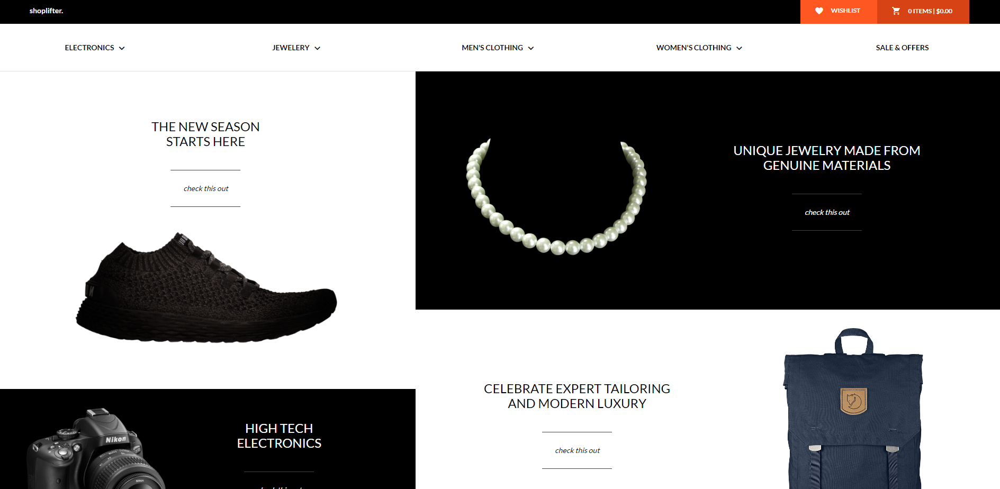
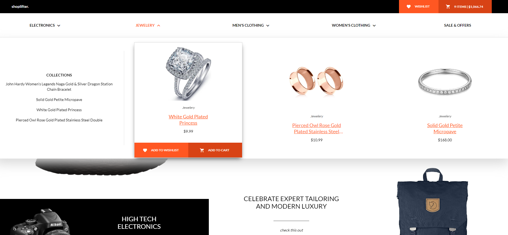
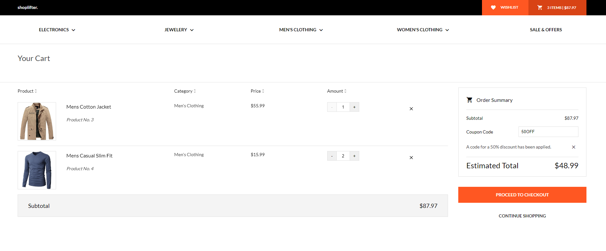

# Shoplifter
A fake eCommerce website, created using Angular 13. Based on 
## Preview images: 

## Technologies used:
- Angular 13
- Angular Material
- Typescript
- SCSS
- HTML5

## Used API:
[Fake Store API](https://fakestoreapi.com/)

## Used Template:
[Shoplifter eCommerce](https://freebies.fluxes.com/shoplifter-ecommerce-free-psd-template/)

## Development server
Run `ng serve` for a dev server. Navigate to `http://localhost:4200/`. The app will automatically reload if you change any of the source files.

## Room for improvement
- Unit and integration tests
- Full responsive design
- Search bar
- Products filters
